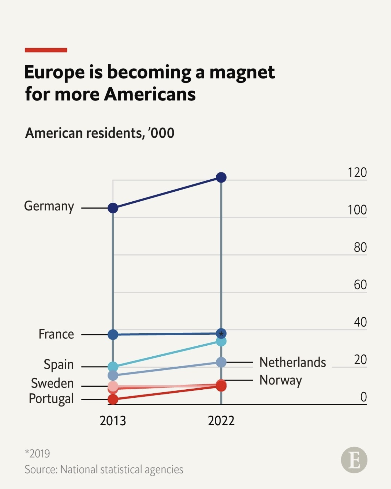
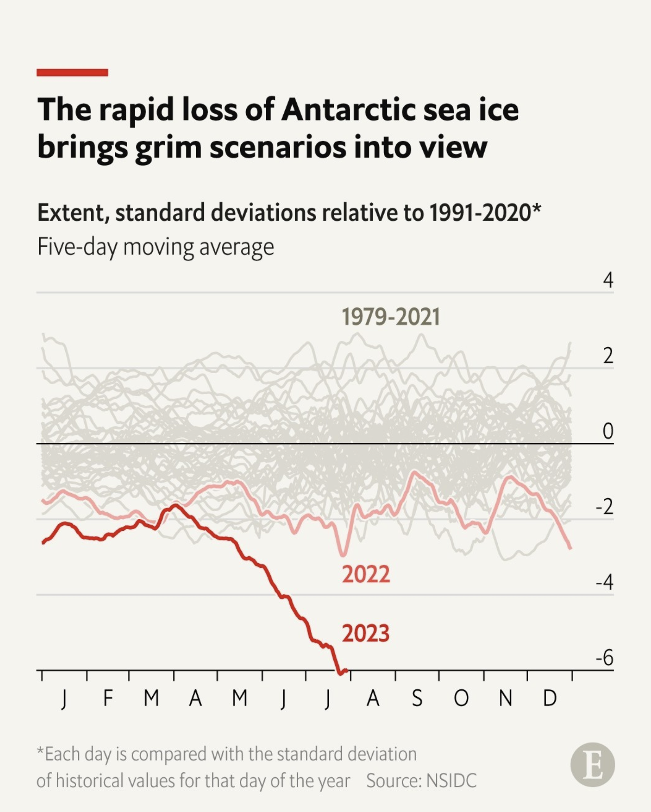
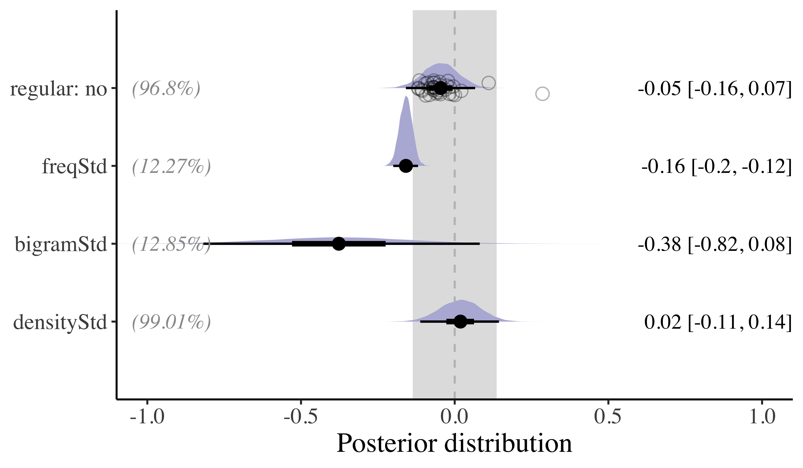

```{r setup, include=FALSE}
library(tidyverse)
library(Hmisc)
library(kableExtra)
library(languageR)
data(english)

options(htmltools.dir.version = FALSE)

knitr::opts_chunk$set(
  collapse = TRUE,
  comment = "#>"
)

```

class: title-slide, inverse, center, middle

# Workshop
## Visualização de dados com ggplot
<a href = "https://gdgarcia.ca" style="color: #FEC20B">Guilherme D. Garcia</a> | Université Laval • Centre for Research on Brain, Language & Music (CRBLM) 

<a href = "http://ronaldolimajr.github.io" style="color: #FEC20B">Ronaldo Lima Jr.</a> | Universidade de Brasília • CNPq


<!-- #### Université Laval • Centre for Research on Brain, Language & Music (CRBLM) -->
<!-- #### Universidade de Brasília • CNPq -->

---

```{r xaringanExtra, echo=FALSE}
# xaringanExtra::use_tile_view()
xaringanExtra::use_scribble()
xaringanExtra::use_clipboard(button_text = "Clique para copiar", success_text = "Copiado!")
# xaringanExtra::use_search(show_icon = TRUE)
xaringanExtra::use_progress_bar(location = "bottom", color = "darkorange2")
options(htmltools.dir.version = FALSE)
xaringanExtra::use_editable()
xaringanExtra::use_panelset()
xaringanExtra::use_extra_styles(
  hover_code_line = TRUE,         #<<
  mute_unhighlighted_code = FALSE  #<<
)

```

## Apresentação

---

## Questionário

- Para começar, um quiz 
- Visite <https://forms.office.com/r/eg7M9cnzd8> ou use seu celular no QR abaixo

<br>


.center[]


---

class: inverse, center, middle

## Eficiência em gráficos

---

## Visualização de dados 😞

```{r, message=FALSE, echo=FALSE}
d = read_csv("feedbackData.csv")

dLong = d %>% 
  pivot_longer(names_to = "Task", #<<
               values_to = "Score", #<<
               cols = task_A1:task_B5) %>% #<<
  mutate(Task = str_sub(Task, start = -2L, end = -1L ),
         Item = str_sub(Task, start = -1L, end = -1L),
         Task = str_sub(Task, start = -2L, end = -2L)) %>% 
  select(ID:Task, Item, Score)
```

- Uma figura pouco eficiente : somente uma variável é mostrada (`Feedback`)
- Somente médias estão presentes; não temos ideia da incerteza dessas médias (e.g., erro padrão)

.pull-left[
```{r, fig.height=5, dev='svg', fig.align='center', echo=F, message = F}
ggplot(data = dLong, aes(x = Feedback, y = Score)) + 
  stat_summary(fun = mean, geom = "bar", 
               alpha = 0.5, color = "black",
               width = 0.5) +
  theme_classic() +
  theme(text = element_text(size = 18))
```
]

.pull-right[
```{r, fig.height=5, dev='svg', fig.align='center', echo=F, message = F}
ggplot(data = tibble(x = c(-2.5, 2.5)),
       aes(x = x)) + 
  stat_function(fun = dnorm) +
  stat_function(fun = dnorm,
                xlim = c(-0.7, 0.7),
                geom = "area",
                alpha = 0.3) +
  stat_function(fun = dnorm,
                xlim = c(-2, -2),
                geom = "point",
                alpha = 1, size = 8,
                color = "darkorange2") +
  theme_classic() + 
  theme(axis.ticks = element_blank(),
        axis.text = element_blank(),
        text = element_text(size = 18)) +
  labs(y = "Figure efficiency",
       x = "Amount of information in figure")
```
]

---

# Visualização de dados 😕

- Melhor, mas `Feedback` está completamente diferente agora
- Aqui, vemos o erro padrão também: demonstração [**aqui**](https://guilherme.shinyapps.io/stats101)

.pull-left[
```{r, fig.height=5, dev='svg', fig.align='center', echo=F, message = F}
ggplot(data = dLong, aes(x = Feedback, y = Score)) + 
  stat_summary() +
  theme_classic() +
  theme(text = element_text(size = 18))
```
]

.pull-right[
```{r, fig.height=5, dev='svg', fig.align='center', echo=F, message = F}
ggplot(data = tibble(x = c(-2.5, 2.5)),
       aes(x = x)) + 
  stat_function(fun = dnorm) +
  stat_function(fun = dnorm,
                xlim = c(-0.7, 0.7),
                geom = "area",
                alpha = 0.3) +
  stat_function(fun = dnorm,
                xlim = c(-1.5, -1.5),
                geom = "point",
                alpha = 1, size = 8,
                color = "darkorange2") +
  theme_classic() + 
  theme(axis.ticks = element_blank(),
        axis.text = element_blank(),
        text = element_text(size = 18)) +
  labs(y = "Figure efficiency",
       x = "Amount of information in figure")
```
]

---

# Visualização de dados 🥰

- Melhor ainda: gráficos de caixa nos dão muito mais informação sobre a dispersão dos dados

.pull-left[
```{r, fig.height=5, dev='svg', fig.align='center', echo=F, message = F}
ggplot(data = dLong, aes(x = Feedback, y = Score)) + 
  geom_boxplot() +
  stat_summary() +
  theme_classic() +
  theme(text = element_text(size = 18))
```
]

.pull-right[
```{r, fig.height=5, dev='svg', fig.align='center', echo=F, message = F}
ggplot(data = tibble(x = c(-2.5, 2.5)),
       aes(x = x)) + 
  stat_function(fun = dnorm) +
  stat_function(fun = dnorm,
                xlim = c(-0.7, 0.7),
                geom = "area",
                alpha = 0.3) +
  stat_function(fun = dnorm,
                xlim = c(-0.75, -0.75),
                geom = "point",
                alpha = 1, size = 8,
                color = "darkorange2") +
  theme_classic() + 
  theme(axis.ticks = element_blank(),
        axis.text = element_blank(),
        text = element_text(size = 18)) +
  labs(y = "Figure efficiency",
       x = "Amount of information in figure")
```
]


---

# Visualização de dados 😍

- Agora também temos informação sobre a variável `Task` (aparentemente nenhuma interação com `Feedback`)
- A figura nos permite comparar efeitos de duas variáveis sobre `Score`

.pull-left[
```{r, fig.height=5, dev='svg', fig.align='center', echo=F, message = F}
ggplot(data = dLong, aes(x = Feedback, y = Score)) + 
  geom_boxplot(aes(fill = Task)) +
  stat_summary(aes(group = Task), 
               position = position_dodge(width = 0.75),
               color = "black") +
  theme_classic() +
  theme(legend.position = "top") +
  scale_fill_manual(values = c("white", "gray")) +
  theme(text = element_text(size = 18))
```
]

.pull-right[
```{r, fig.height=5, dev='svg', fig.align='center', echo=F, message = F}
ggplot(data = tibble(x = c(-2.5, 2.5)),
       aes(x = x)) + 
  stat_function(fun = dnorm) +
  stat_function(fun = dnorm,
                xlim = c(-0.7, 0.7),
                geom = "area",
                alpha = 0.3) +
  stat_function(fun = dnorm,
                xlim = c(-0.25, -0.25),
                geom = "point",
                alpha = 1, size = 8,
                color = "darkorange2") +
  theme_classic() + 
  theme(axis.ticks = element_blank(),
        axis.text = element_blank(),
        text = element_text(size = 18)) +
  labs(y = "Figure efficiency",
       x = "Amount of information in figure")
```
]

---

# Visualização de dados 🤯

- Agora adicionamos `L1` (means): sem efeito claro (texto esconde médias e erro padrão)
- Total de variáveis: `Score ~ Feedback + Task + L1` (todos os preditores são *categóricos* aqui)

.pull-left[
```{r, fig.height=5, dev='svg', fig.align='center', echo=F, message = F, warning=FALSE}
ggplot(data = dLong, aes(x = Feedback, y = Score)) + 
  geom_boxplot(aes(fill = Task)) +
  stat_summary(aes(group = Task), 
               position = position_dodge(width = 0.75),
               color = "black") +
  geom_text(d = dLong %>% 
              group_by(Feedback, Task, L1) %>% 
              dplyr::summarize(Score = mean(Score)),
            position = position_dodge(width = 0.75),
            aes(group = Task, label = L1), color = "darkviolet") +
  theme_classic() +
  theme(legend.position = "top") +
  scale_fill_manual(values = c("white", "gray")) +
  theme(text = element_text(size = 18))
```
]

.pull-right[
```{r, fig.height=5, dev='svg', fig.align='center', echo=F, message = F}
ggplot(data = tibble(x = c(-2.5, 2.5)),
       aes(x = x)) + 
  stat_function(fun = dnorm) +
  stat_function(fun = dnorm,
                xlim = c(-0.7, 0.7),
                geom = "area",
                alpha = 0.3) +
  stat_function(fun = dnorm,
                xlim = c(0.45, 0.45),
                geom = "point",
                alpha = 1, size = 8,
                color = "darkorange2") +
  theme_classic() + 
  theme(axis.ticks = element_blank(),
        axis.text = element_blank(),
        text = element_text(size = 18)) +
  labs(y = "Figure efficiency",
       x = "Amount of information in figure")
```
]

---

# Visualização de dados 🤒

- Aqui vemos pontos individuais (muita informação)
- Variáveis: `Score ~ Feedback + Task + L1 + ID`

.pull-left[
```{r, fig.height=5, dev='svg', fig.align='center', echo=F, message = F}
ggplot(data = dLong, aes(x = Feedback, y = Score)) + 
  geom_boxplot() +
  stat_summary(aes(group = Task), 
               position = position_dodge(width = 0.75),
               color = "black") +
  geom_text(d = dLong %>% 
              group_by(Feedback, Task, L1) %>% 
              dplyr::summarize(Score = mean(Score)),
            position = position_dodge(width = 0.75),
            aes(group = Task, label = L1), color = "darkviolet") +
  # stat_summary(aes(group = Item), geom = "line") +
  geom_jitter(alpha = 0.2, aes(group = ID)) +
  theme_classic() +
  facet_grid(~Task, labeller = "label_both") +
  theme(legend.position = "top") +
  scale_fill_manual(values = c("white", "gray")) +
  theme(text = element_text(size = 18))
```
]

.pull-right[
```{r, fig.height=5, dev='svg', fig.align='center', echo=F, message = F}
ggplot(data = tibble(x = c(-2.5, 2.5)),
       aes(x = x)) + 
  stat_function(fun = dnorm) +
  stat_function(fun = dnorm,
                xlim = c(-0.7, 0.7),
                geom = "area",
                alpha = 0.3) +
  stat_function(fun = dnorm,
                xlim = c(1.2, 1.2),
                geom = "point",
                alpha = 1, size = 8,
                color = "darkorange2") +
  theme_classic() + 
  theme(axis.ticks = element_blank(),
        axis.text = element_blank(),
        text = element_text(size = 18)) +
  labs(y = "Figure efficiency",
       x = "Amount of information in figure")
```
]


---

class: inverse, center, middle

## Tipos de gráficos

---


## Preparação

- Dados utilisados: <mark>`english`</mark> (pacote `languageR`)

```{r}
data(english)
english = english |> 
  select(RTlexdec, Familiarity, Word, AgeSubject)
glimpse(english)
```


---

### y contínuo e x categórico

```{r, out.width="50%", echo=FALSE, cache=TRUE, fig.height=4, fig.width = 5, message = FALSE, dpi=500}
ggplot(data =english, aes(x = AgeSubject, y = RTlexdec)) + 
  # stat_summary(geom = "bar", width = 0.5, 
  #              fill = "darkorange2", alpha = 0.5,
  #              color = "black") +
  stat_summary() + 
  theme_classic() +
  theme(text = element_text(size = 15)) +
  labs(title = "Média e erro padrão")

ggplot(data =english, aes(x = AgeSubject, y = RTlexdec)) + 
  stat_summary(geom = "bar", width = 0.5, 
               fill = "darkorange2", alpha = 0.5,
               color = "black") +
  stat_summary() + 
  theme_classic() +
  theme(text = element_text(size = 15)) +
  labs(title = "Com barras")


```

---

### y contínuo e x categórico

```{r, out.width="50%", echo=FALSE, cache=TRUE, fig.height=4, fig.width = 5, message = FALSE, dpi=500}
ggplot(data = english, aes(x = AgeSubject, y = RTlexdec)) + 
  geom_boxplot(fill = "darkorange2", alpha = 0.5) +
  theme_classic() +
  theme(text = element_text(size = 15)) +
  labs(title = "Gráfico de caixas")

ggplot(data =english, aes(x = AgeSubject, y = RTlexdec)) + 
  geom_violin(fill = "darkviolet", alpha = 0.5) +
  theme_classic() +
  theme(text = element_text(size = 15)) +
  labs(title = "Gráfico de violino")


```

---

### y e x contínuos

```{r, out.width="50%", echo=FALSE, cache=TRUE, fig.height=4, fig.width = 5, message = FALSE, dpi=500}
ggplot(data = english, aes(x = Familiarity, y = RTlexdec)) + 
  geom_point(color = "darkorange2", alpha = 0.2) +
  theme_classic() +
  theme(text = element_text(size = 15)) +
  labs(title = "Gráfico de dispersão")

ggplot(data =english, aes(x = Familiarity, y = RTlexdec)) + 
  geom_point(color = "darkviolet", alpha = 0.2) +
  geom_smooth(method = "lm", color = "black") +
  theme_classic() +
  theme(text = element_text(size = 15)) +
  labs(title = "Gráfico de dispersão + tendência",
       subtitle = "Uma única linha de tendência")


```

---

### y e x contínuos + z categórico

.pull-left[
  

```{r, out.width="95%", echo=FALSE, cache=TRUE, fig.height=4, fig.width = 5, message = FALSE, dpi=500, fig.align='center'}

colours = c("darkorange", "royalblue")
names(colours) = c("old", "young")

customSub = glue::glue('Tempos de reação para
       <span style="color:{colours["old"]}">**old**</span> 
       e 
       <span style="color:{colours["young"]}">**young**</span>')

ggplot(data = english, aes(x = Familiarity, y = RTlexdec, color = AgeSubject)) + 
  geom_point(alpha = 0.2) +
  theme_classic() +
  scale_color_manual(values = c("darkorange2", "royalblue")) +
  stat_smooth(method = "lm") +
  theme(text = element_text(size = 15),
        plot.subtitle = ggtext::element_markdown(),
        legend.position = "none") +
  labs(title = "Gráfico de dispersão",
       subtitle = customSub)
```
]

.pull-right[

- Terceira variável (idade) + cor em subtítulo

- Duas linhas de tendência

- Bom grau de informação e fácil leitura 😃

- Eixos podem melhorar (qual a escala de $y$?)  🤨

]


---

## Boas práticas

### Alguns pontos a considerar

.pull-left[


- Gráfico apropriado aos dados

- Quantidade apropriada de informação

- Tamanho (e tipo) de fonte

- Clareza de variáveis

- Uso consistente de cores

- Alinhamento entre figura e análise

- Consistência ao longo do documento
]

.pull-right[

- Definição apropriada (≥500 `dpi`) 🫠

```{r, out.width="90%", echo=FALSE, cache=TRUE, fig.height=4, fig.width = 5, message = FALSE, dpi=80, fig.align='center'}

colours = c("darkorange", "royalblue")
names(colours) = c("old", "young")

customSub = glue::glue('Tempos de reação para
       <span style="color:{colours["old"]}">**old**</span> 
       e 
       <span style="color:{colours["young"]}">**young**</span>')

ggplot(data = english, aes(x = Familiarity, y = RTlexdec, color = AgeSubject)) + 
  geom_point(alpha = 0.2) +
  theme_classic() +
  scale_color_manual(values = c("darkorange2", "royalblue")) +
  stat_smooth(method = "lm") +
  theme(text = element_text(size = 8),
        plot.subtitle = ggtext::element_markdown(),
        legend.position = "none") +
  labs(title = "Gráfico de dispersão",
       subtitle = customSub)
```

]


---

## Exemplo não acadêmico: The Economist

.pull-left[

.center[]

]

.pull-right[

.center[]

]


---

## Exemplo acadêmico: resultado de modelo estatístico

- Combinação de efeito, intervalo, porcentagem de efeito na ROPE, e efeito misto ([Garcia & Guzzo 2022](https://jpl.letras.ulisboa.pt/article/id/8188/))

<br>

.center[]

---


## Painéis (*facets*)

- Dados no **eixo y** comparados: um único eixo y com todos os painéis alinhados horizontalmente<sup>`*`</sup>
- Dados no **eixo x** comparados: painéis empilhados
- Matriz se os dados de cada painel não estiverem relacionados ou se o espaço for muito pequeno

<!-- ### Exemplo -->


```{r, echo=FALSE, message=FALSE, out.width="72%", cache=TRUE, fig.height=4.3, fig.width = 9, message = FALSE, dpi=500, fig.align='center'}

# Data set creation.
set.seed(93384)

time <- c(0, 0.5, 1, 2, 4, 8, 12, 16, 24)
n <- 32 # no of subjects

data <- expand.grid(ID = 1:n, time = time)

bw <- data.frame(
  ID = sort(unique(data$ID)),
  bw = rlnorm(n, log(75), sdlog = 0.25)
)

bw$bw.category <- cut(bw$bw,
  breaks = quantile(bw$bw, c(0, 0.33, 0.66, 1)),
  labels = paste(c("low", "medium", "high"), "body weight"),
  include.lowest = TRUE
)

data <- merge(data, bw)

data <- data[order(data$ID, data$time), ]

# Simulate drug concentrations as a function of body weight.
data$conc <- 100 / (data$bw^1.0) * exp(-0.085 * data$time) *
  rlnorm(nrow(data), sdlog = 0.25) + # res. error
  (data$ID - mean(data$ID)) / mean(data$ID) / 4 # r. eff

# ---
# Visualisation.
library(ggplot2)

gg <- list()

data$ID <- factor(data$ID)

gg[["3x1"]] <- ggplot(data, aes(x = time, y = conc, group = ID, color = ID)) +
  geom_line()
gg[["3x1"]] <- gg[["3x1"]] + scale_x_continuous(breaks = seq(0, 24, by = 4))
gg[["3x1"]] <- gg[["3x1"]] + theme_bw() + 
  xlab("time [h]") + 
  ylab("drug concentration [ng/mL]")
gg[["3x1"]] <- gg[["3x1"]] + facet_grid(bw.category ~ .)
gg[["3x1"]] <- gg[["3x1"]] + theme(legend.position = "none")

gg[["1x3"]] <- gg[["3x1"]] + facet_grid(. ~ bw.category)

# Add space to the rhs of the first figure for better separation in the cowplot.
gg[["3x1"]] <- gg[["3x1"]] + 
  theme(plot.margin = unit(c(0.5, 4, 0.5, 0.5), "lines"))

# Both figures into a single output figure.
library(cowplot)
plot_grid(gg[[1]], gg[[2]], rel_widths = c(1.5, 2))
```


.footnote[`*` Fonte: <https://royal-statistical-society.github.io/datavisguide/>]

---

## Proporção de tela (*aspect ratio*)

- Uma figura quadrada evita viés visual na escolha dos eixos y e x<sup>`*`</sup>
- Uma figura quadrada deve ser considerada se os dois eixos têm algo em comum:
   + pré *vs* pós
   + dados observados *vs* valores previstos pelo modelo
   + mesmas unidades


```{r, echo=FALSE, message=FALSE, out.width="74%", cache=TRUE, fig.height=3.5, fig.width = 8, message = FALSE, dpi=500, fig.align='center'}

# Observed vs predicted (any data with comparable x and y will do).

# ---
# Data set.
# Old Faithful Geyser (Yellowstone) data set with eruption duration
#   and waiting time to the next eruption (both in minutes).
data <- data.frame(
  x = faithful$eruptions,
  y = faithful$waiting
)

# ---
# Regression model fit.
fit <- lm(y ~ x, data = data)

# Addition of predicted values to the data set.
data$pred <- predict(fit)

# Range of y and y predicted combined.
r <- range(unlist(data[c("y", "pred")]))

# ---
# Plotting.

library(ggplot2)

gg <- ggplot(data, aes(x = pred, y = y))

# Adding the line of identity, y = x
# (note: plotting it first will add points on top).
gg <- gg + geom_abline(intercept = 0, slope = 1, color = "black", linewidth = 1)

# Adding points, removing grey background.
gg <- gg + geom_point() + theme_bw()

# Adding regression fit (local smoother, loess) of y~x.
gg <- gg + geom_smooth(method = "loess", color = "firebrick", se = FALSE)

# Adding axis labels.
gg <- gg + xlab("predicted") + ylab("observed")

# Aspect ratios are commonly not fixed but adapted to figure size.
#   With dynamic displays, the point of different perception
#   might not be obvious depending on the figure/screen size.
#   To make that point independent of figure height and width,
#     the aspect ratio is fixed in this example.
gg <- gg + coord_fixed(ratio=0.5)

# Copy the figure and fix the aspect ratio to 2, i.e., 
#   one pixel in x corresponds to 2 pixels in y.
gg2 <- gg + coord_fixed(ratio=2)

# Setting the aspect ratio to 1 (1 unit in x and y 
#   corresponds to the same number of pixels) and 
#   setting axis limits to be identical.
gg3 <- gg + coord_fixed(ratio=1, xlim=r, ylim=r)

# Cow (column-wise) plot, combine all figures into one.
library(cowplot)
plot_grid(gg, gg2, gg3, rel_widths = c(4, 2, 3), nrow = 1)
```

.footnote[`*` Fonte: <https://royal-statistical-society.github.io/datavisguide/>]

---

## Eixos

- O eixo deve começar em 0 (a menos que haja um bom motivo para escolher outros intervalos)<sup>`*`</sup>
- Se os dados não contiverem valores negativos, o eixo não deverá se estender para valores negativos
- Se os dados exibidos forem comparáveis, os limites dos eixos deverão ser idênticos

.footnote[`*` Fonte: <https://royal-statistical-society.github.io/datavisguide/>]

```{r, echo=FALSE, message=FALSE, out.width="78%", cache=TRUE, fig.height=3, fig.width = 8, message = FALSE, dpi=500, fig.align='center'}

plot_data <- data.frame(
  type = factor(
    c("Our product", "Competitor"),
    levels = c("Our product", "Competitor")
  ),
  value = c(220, 210)
)

# Original plot
gg1 = ggplot(plot_data) +
  geom_col(
    mapping = aes(x = type, y = value),
    fill = "lightblue",
    colour = "black"
  ) +
  scale_y_continuous(breaks = seq(0, 220, by = 20), expand = c(0, 0)) +
  labs(x = "", y = "") +
  theme_minimal()

# Offset the y axis
offset <- 208
gg2 = ggplot(plot_data) +
  geom_col(
    mapping = aes(x = type, y = value - offset),
    fill = "lightblue",
    colour = "black"
  ) +
  scale_y_continuous(
    breaks = seq(0, 14, by = 2),
    labels = seq(0 + offset, 14 + offset, by = 2),
    expand = c(0, 0)
  ) +
  labs(x = "", y = "") +
  theme_minimal()

# Cow (column-wise) plot, combine all figures into one.
library(cowplot)
plot_grid(gg1, gg2, nrow = 1)

```


---
class: inverse, center, middle

## Introdução ao `ggplot2`


<!-- <iframe src="https://giphy.com/embed/XIqCQx02E1U9W" width="480" height="269" frameBorder="0" class="giphy-embed" allowFullScreen></iframe><p><a href="https://giphy.com/gifs/XIqCQx02E1U9W"></a></p> -->

.center[]

---


## Pacotes

- Antes de irmos ao RStudio: estes são os pacotes que usaremos

```{r, eval=FALSE}
library(tidyverse) # ggplot2, tidyr, etc.
library(Hmisc)     # para complementar estatística básica em ggplot2
library(scales)    # para eixos mais flexíveis
library(languageR) # dados
```

- Importante: há **outros** pacotes para visualização de dados. O `ggplot2` é apenas o mais completo

- `plotly`, `lattice`, `base`, `leaflet`, `ggvis`, ...


---

## Noção de camadas

- A ideia básica de um gráfico com `ggplot2` envolve <mark>**camadas**</mark>

- Camadas são ordenadas linearmente: a camada $n$ será gerada *antes* de $n+1$

- A primeira camada (base) define a origem dos dados, que será "herdada" por outras camadas

```{r, eval = FALSE, message = FALSE}
camada_base(dados, aes(x = ..., y = ..., color = ..., ...)) +
 camada_1() + 
 camada_2() +
 ...+
 camada_n()
```

- Apesar dessa "herança automática", camadas também podem ter certa independência

- Isso nos permite utilizar mais de uma base de dados ao mesmo tempo 🤯

---

## Introdução ao `ggplot2`

```{r, out.width="70%", echo=TRUE, cache=TRUE, fig.height=2.5, fig.width = 5, fig.align='center', message = FALSE, dpi=500}
ggplot(data = english, aes(x = AgeSubject,      # Camada de base: dados
                           y = RTlexdec)) + 
  stat_summary(geom = "bar", width = 0.5) +     # Camada que determina tipo de gráfico
  labs(x = "Idade", y = "Tempo de reação")      # Camada que nomeia os eixos

```


<!-- Dia 2 [aqui](test.html) -->

<!-- --- -->

<!-- ## Visualização descritiva -->

<!-- --- -->

<!-- ## Prática -->

